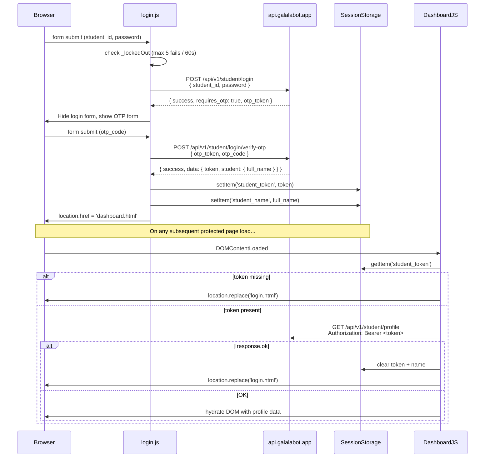
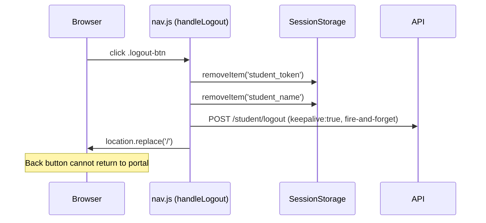
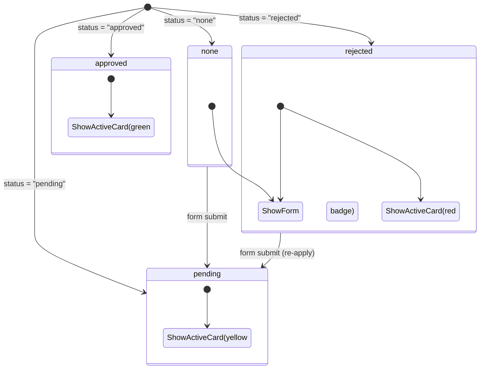

# FRONT_PROJECT_CONTEXT.md
> **Purpose:** This document is the canonical AI memory/handoff artifact for the `frontend_final` project. An AI assistant that reads this file end-to-end can immediately continue development, security auditing, debugging, or deployment of the project without reading the raw source code.
>
> **Generated:** 2026-05-23 | **Confidence:** High — derived from direct source-file analysis, no inference from names alone.

---

## Table of Contents
1. [Project Overview](#1-project-overview)
2. [Full Tech Stack](#2-full-tech-stack)
3. [Repository Structure](#3-repository-structure)
4. [System Architecture](#4-system-architecture)
5. [Frontend Analysis](#5-frontend-analysis)
6. [API Documentation](#6-api-documentation)
7. [Authentication & Security](#7-authentication--security)
8. [Infrastructure & Deployment](#8-infrastructure--deployment)
9. [AI / ML Services](#9-ai--ml-services)
10. [Dependencies Analysis](#10-dependencies-analysis)
11. [Environment Variables Reference](#11-environment-variables-reference)
12. [Development Workflow](#12-development-workflow)
13. [Known Issues & Technical Debt](#13-known-issues--technical-debt)
14. [Suggested Improvements](#14-suggested-improvements)
15. [AI Context Summary](#15-ai-context-summary)

---

## 1. Project Overview

### What the System Does
**Galala Uni** is a university student portal and admission gateway — a static, pure-HTML/CSS/JavaScript front-end web application that connects enrolled students and prospective applicants to their academic world. It acts as a thin client that communicates entirely with a remote REST API backend (`api.galalabot.app`) and optionally an AI service endpoint (`ai.galalabot.app`).

### Main Business / Domain Purpose
- **University of Galala** (Egypt) student-facing portal.
- Serves two distinct user populations:
  1. **Guests / Prospective Students** — unauthenticated users who can talk to an Admission Chatbot to learn about deadlines, scholarships, visa requirements, and tuition.
  2. **Enrolled Students (authenticated)** — students who log in via Bearer-token authentication to access their academic profile, GPA tracker, vehicle campus-access permit system, and an AI-powered academic assistant chatbot.

### Core Features
| Feature | Target User | Auth Required |
|---|---|---|
| Landing page / journey selector | Guest + Student | No |
| AI Admission Chatbot | Guest | No |
| Student Login | Student | No (initiates auth) |
| Student Dashboard (GPA, credits, identity card) | Student | Yes |
| AI Academic Assistant Chatbot | Student | Yes (UI only) |
| Vehicle Campus Access Permit (request, view, history) | Student | Yes |
| Help & Support page | Student | Yes (UI only) |

### User Roles
| Role | Description | Access |
|---|---|---|
| **Guest** | Unauthenticated visitor | Landing page + Public Chatbot |
| **Student** | Authenticated via Bearer token stored in `sessionStorage` | Full portal (Dashboard, Chatbot, Vehicle, Help) |

There are **no admin roles** in this frontend — administration is backend-only.

### High-Level Architecture Summary
- **Type:** Multi-page static web application (MPA). No JavaScript framework (React, Vue, etc.). No build step, no bundler, no package.json.
- **Hosting model inferred:** Static file server / CDN serving HTML/CSS/JS directly. The backend is a remote API at a different domain.
- **Module system:** Native ES Modules (`type="module"`). `config.js` is imported as a module; other JS files are loaded as classic scripts (no `type="module"` on most `<script>` tags — **important technical debt, see §13**).
- **Auth model:** Bearer-token SPA pattern — token lives in `sessionStorage`.
- **API communication:** `fetch()` with `Authorization: Bearer <token>` header.
- **Chatbot:** Currently a client-side keyword-matching engine (not a real LLM call). The config exposes an `AI_BASE_URL` but no JS code currently calls it — **the AI backend endpoint is prepared but unused**.

---

## 2. Full Tech Stack

### Frontend
| Layer | Technology | Notes |
|---|---|---|
| Structure | HTML5 | Semantic, WCAG-aware |
| Styling | Vanilla CSS (custom design system) | CSS custom properties (tokens), no framework |
| Logic | Vanilla JavaScript (ES2020+) | Native ES Modules (`import`/`export`) |
| Fonts | Inter (body/head) + self-hosted woff2 subset | Loaded from `css/fonts/fonts.css` |
| Icons | Inline SVG (Heroicons style) | No external icon library |
| Animations | CSS keyframes + transitions | `@keyframes slide-up-fade`, `msg-in`, `typing-bounce`, `pulse-dot`, `float-scroll` |

### Backend (Remote — Not in this repo)
| Layer | Technology | Notes |
|---|---|---|
| API Base | `https://api.galalabot.app/api/v1` | REST JSON API, inferred Laravel/PHP or similar |
| AI Service | `https://ai.galalabot.app` | Separate subdomain, unused in current JS |
| Auth | Bearer Token (JWT-style) | Issued at `/student/login`, invalidated at `/student/logout` |
| Protocol | HTTPS only | Both API and AI endpoints are HTTPS |

### Authentication
- Bearer token stored in `sessionStorage` (not `localStorage` — intentional security choice: cleared on tab close)
- Student name cached in `sessionStorage` alongside token

### Deployment Stack (Inferred)
| Component | Details |
|---|---|
| Hosting | Static file server (no server-side rendering) |
| Domain inferred | `galalabot.app` (shared with API) |
| SSL | Yes (both API URLs are HTTPS) |
| CDN | Unknown — not confirmed by code |
| Backend infra | Unknown — separate repo, separate domain |

### DevOps / Tooling
- **None** — no build tooling, no CI/CD configuration, no `package.json`, no `Makefile`, no Docker files, no `.env` files in this repo.
- All configuration is hardcoded in `js/config.js`.

### Monitoring / Logging
- **None** in this frontend. No error tracking (Sentry, etc.), no analytics scripts, no logging framework. Errors are silently swallowed (`catch {}` with no logging — RT-15 intentional fix).

### External Integrations
- `https://api.galalabot.app/api/v1` — Primary backend REST API
- `https://ai.galalabot.app` — AI service (configured but not yet connected in code)

---

## 3. Repository Structure

```
frontend_final/                     ← Project root (served as webroot)
│
├── index.html                      ← ENTRY POINT: Landing page (public)
├── gu_logo.png                     ← Galala Uni logo (used in all nav bars)
│
├── pages/                          ← All sub-pages
│   ├── login.html                  ← Student login form
│   ├── dashboard.html              ← Authenticated student home
│   ├── chatbot.html                ← AI Academic Assistant (auth-gated UI)
│   ├── chatbot-public.html         ← Admission Chatbot (public, no auth)
│   ├── vehicle.html                ← Vehicle permit management
│   └── help.html                   ← Help & Support (static FAQ)
│
├── js/                             ← JavaScript modules
│   ├── config.js                   ← ⭐ CENTRAL CONFIG: API URLs + endpoints (ES module export)
│   ├── nav.js                      ← Navigation: mobile toggle, active links, student hydration, logout
│   ├── login.js                    ← Login form handler, brute-force lockout (5 attempts / 60s)
│   ├── dashboard.js                ← Fetches /student/profile, populates identity card + GPA ring
│   ├── vehicle.js                  ← Vehicle permit state, history fetch, form submit + validation
│   └── chatbot.js                  ← Chatbot UI engine: input, message rendering, keyword responses
│
├── css/                            ← Stylesheets
│   ├── globals.css                 ← ⭐ DESIGN SYSTEM: tokens, reset, buttons, nav, cards, forms, badges
│   ├── dashboard.css               ← Dashboard/portal page styles (identity card, GPA ring, quick cards)
│   ├── landing.css                 ← Landing page styles (hero, journey cards, stats, features, CTA)
│   ├── chatbot.css                 ← Chat window, message bubbles, typing indicator, chips
│   └── fonts/
│       ├── fonts.css               ← @font-face declarations for self-hosted Inter subset
│       └── *.woff2                 ← Self-hosted Inter font files (14 files, multiple weights)
│
└── .git/                           ← Git repository metadata
```

### Key File Roles at a Glance

| File | Role | Notes |
|---|---|---|
| `index.html` | Public landing / entry point | Imports `nav.js` as module; no auth JS |
| `js/config.js` | Single source of truth for all API URLs | Frozen object, ES module default export |
| `js/nav.js` | Shared nav behaviour across all pages | Runs as IIFE + exposes `handleLogout` |
| `js/login.js` | Auth initiation | Writes token to sessionStorage |
| `js/dashboard.js` | Profile data fetch + DOM hydration | Auth guard: redirect on non-OK response |
| `js/vehicle.js` | Most complex module | 288 lines; handles 4 vehicle states |
| `js/chatbot.js` | Chatbot UI + response engine | Keyword matcher; AI API not yet wired |
| `css/globals.css` | Design system foundation | ~602 lines of CSS variables + components |
| `css/dashboard.css` | Portal page-specific styles | ~838 lines; includes login, vehicle, help |

### Entry Points
- `index.html` — Guest / landing entry
- `pages/login.html` — Authenticated entry (linked from landing)
- `pages/chatbot-public.html` — Guest chatbot entry (linked from landing)

### Configuration Files
- `js/config.js` — API base URLs and endpoint paths. **No `.env` file exists** — configuration is baked into source.

---

## 4. System Architecture

### High-Level Flow

```mermaid
graph TD
    subgraph "Client (Browser)"
        A[index.html<br/>Landing] -->|Guest| B[chatbot-public.html<br/>Admission Bot]
        A -->|Student| C[login.html<br/>Login Form]
        C -->|POST /student/login| D{Backend API}
        D -->|token + name| E[sessionStorage]
        E --> F[dashboard.html]
        F --> G[chatbot.html]
        F --> H[vehicle.html]
        F --> I[help.html]
    end

    subgraph "Remote Backend"
        D
        J[/student/profile]
        K[/student/vehicle]
        L[/student/vehicle-requests]
        M[/student/vehicle-requests/history]
        N[/student/logout]
    end

    subgraph "AI Service (Configured, Unused)"
        O[ai.galalabot.app]
    end

    F -->|GET + Bearer| J
    H -->|GET + Bearer| K
    H -->|POST + Bearer| L
    H -->|GET + Bearer| M
    G -.->|planned| O
    B -.->|planned| O

    style O stroke-dasharray: 5 5
```

### Authentication Flow



### Logout Flow



### Page → JS Module Mapping

| HTML Page | Scripts Loaded | Auth Guard |
|---|---|---|
| `index.html` | `nav.js` (module) | None |
| `pages/login.html` | `login.js` (module) | None |
| `pages/dashboard.html` | `nav.js` (module) + `dashboard.js` (**module**) | Yes — in `dashboard.js` |
| `pages/chatbot.html` | `nav.js` (module) + `chatbot.js` (**module**) | None in JS — chatbot accessible without token |
| `pages/chatbot-public.html` | `nav.js` (module) + `chatbot.js` (**module**) | None (public) |
| `pages/vehicle.html` | `nav.js` (module) + `vehicle.js` (**module**) | Yes — in `vehicle.js` |
| `pages/help.html` | `nav.js` (module) | None in JS |

> **⚠️ Security Note:** `chatbot.html` and `help.html` have no JS auth guard. A user who manually navigates to these URLs without a token will reach the page. The nav will simply show no student name. This is a known weak spot (see §13).

---

## 5. Frontend Analysis

### Pages

#### `index.html` — Landing Page
- **Purpose:** Public entry point. Presents the university brand, intro section, and a "journey selector" with two cards: one for guests (→ chatbot-public) and one for students (→ login).
- **Sections:** Glassmorphism nav → Hero intro (animated `slide-up-fade`) → Journey grid (2-column) → Footer with social links.
- **Key elements:**
  - `.home-intro` with decorative geometric orbs (CSS squares rotated)
  - `.journey-grid` → two `.journey-card` elements with feature lists and CTA buttons
  - Footer: copyright 2022, Twitter + LinkedIn icons (placeholder `href="#"`)
- **Scripts:** Only `nav.js` (mobile toggle, active link highlight).
- **No API calls** on this page.

#### `pages/login.html` — Student Login
- **Purpose:** Credential entry for enrolled students.
- **Form:** `id="login-form"` with fields `student-id` (text) + `password` (password). Custom eye-toggle button (`id="pwd-toggle"`) swaps password visibility. No native browser password reveal (hidden via CSS).
- **Auth attributes:** `autocomplete="username"` / `autocomplete="current-password"` set correctly for password manager compatibility.
- **Error display:** `id="login-error"` div, hidden by default, shown on failure.
- **Scripts:** `login.js` (module).

#### `pages/dashboard.html` — Student Dashboard
- **Purpose:** Authenticated home page. Shows identity card, quick-action cards, personal info, GPA ring, and credit bar.
- **Structure:**
  - Dark glass nav with student avatar + name hydrated from sessionStorage/API
  - `.identity-card` — gradient navy card with avatar initials, full name, faculty, student ID, academic year, GPA badge
  - `.quick-grid` — 2 cards: AI Assistant (→ chatbot.html), Vehicle Permit (→ vehicle.html)
  - `.dash-bottom` — 2-column: left = Personal Info (name, DOB, email); right = Academic Standing (GPA ring SVG + credit bar)
- **Note RT-19:** DOB and GPA are **not hardcoded** in HTML. They are populated entirely from the API response.
- **Scripts:** `nav.js` (module) + `dashboard.js` (classic — **mixed module/classic loading, see §13**).

#### `pages/chatbot.html` — AI Academic Assistant (Authenticated Context)
- **Purpose:** Chat interface for enrolled students to ask about courses, deadlines, campus policy.
- **Layout:** Centered single-column, max-width 900px, padding accounts for fixed nav.
- **Components:** Chat header (dark), scrollable chat body, quick-reply chip strip (5 chips), textarea input with auto-grow, send button.
- **Greeting:** Hardcoded HTML greeting mentioning "Alexandria" — **this is a hardcoded placeholder name, not dynamic** (see §13).
- **Chips:** `data-quick="..."` attributes; wired by `chatbot.js` via `addEventListener`.
- **Scripts:** `nav.js` (module) + `chatbot.js` (classic).
- **No auth guard** in JavaScript.

#### `pages/chatbot-public.html` — Admission Chatbot (Public)
- **Purpose:** Unauthenticated visitor chatbot for prospective students.
- **Layout:** 2-column grid: left = FAQ panel (4 preset question buttons), right = chat window.
- **FAQ chips:** `data-question="..."` attributes; wired by `chatbot.js`.
- **Nav:** Light glass nav (not dark), shows "Student Login" CTA.
- **Responsive:** FAQ panel hidden on mobile (`display:none`).
- **Scripts:** `nav.js` (module) + `chatbot.js` (classic).

#### `pages/vehicle.html` — Vehicle Campus Access
- **Purpose:** Students manage their vehicle campus permit.
- **Dynamic cards (all JS-rendered):**
  - `#active-vehicle-card` — shows current vehicle state (none / pending / approved / rejected)
  - `#vehicle-history-card` — shows history list of all past requests
  - `#request-vehicle-card` — registration form (only shown when status is `none` or `rejected`)
- **Plate preview:** Live `#plate-display` element updates as user types the plate number.
- **Form fields:** `#plate` (license plate), `#make` (vehicle type), `#model` (vehicle model), `#color` (vehicle color).
- **Scripts:** `nav.js` (module) + `vehicle.js` (classic).

#### `pages/help.html` — Help & Support
- **Purpose:** Static informational page. No API calls, no form submissions.
- **Content:** Contact card (mailto link to `support@gu.edu.eg`), 6 FAQ cards covering: vehicle gate issue, login issues, course/GPA questions, AI assistant issues, bug reports, account/privacy.
- **Scripts:** `nav.js` (module) only.

---

### JavaScript Modules

#### `js/config.js` — Central Configuration
```javascript
const APP_CONFIG = Object.freeze({
    API_BASE_URL: "https://api.galalabot.app/api/v1",
    AI_BASE_URL:  "https://ai.galalabot.app",
    ENDPOINTS: Object.freeze({
        STUDENT_LOGIN:            "/student/login",
        STUDENT_LOGOUT:           "/student/logout",
        STUDENT_PROFILE:          "/student/profile",
        STUDENT_VEHICLE:          "/student/vehicle",
        STUDENT_VEHICLE_REQUESTS: "/student/vehicle-requests",
        STUDENT_VEHICLE_HISTORY:  "/student/vehicle-requests/history",
    })
});
export default APP_CONFIG;
```
- **Pattern:** Frozen object prevents accidental mutation. ES module export prevents global namespace pollution.
- **Security:** `Object.freeze()` used at both levels. Cannot be monkey-patched from console after page load (though page code running first could override it — see §13).
- **AI_BASE_URL** is present but **never consumed** by any current code.

---

#### `js/login.js` — Login Handler
- **Purpose:** Handles student authentication.
- **Inputs:** `#student-id` (text), `#password` (password)
- **Outputs:** `sessionStorage.student_token`, `sessionStorage.student_name`, redirect to `dashboard.html`
- **Key logic:**
  - `_failCount` / `_lockedOut` — module-scoped counters (in-memory only; not persisted).
  - `MAX_FAILS = 5` — after 5 failures, 60-second UI lockout.
  - `togglePwd()` — swaps input type password↔text, updates SVG icon.
  - `handleLogin()` — `fetch()` POST to API; on success writes sessionStorage; on failure increments counter.
- **Dependencies:** `config.js`
- **Security:** Brute-force lockout is client-side only — easily bypassed by refreshing the page (see §13).

---

#### `js/nav.js` — Navigation Controller
- **Purpose:** Shared across all authenticated pages. Handles mobile menu, active link, student name hydration, logout.
- **Pattern:** Immediately-invoked function expression (IIFE) for setup logic; `handleLogout` defined as module-level function for the logout button listeners.
- **Student name hydration:**
  - Reads `sessionStorage.student_name`
  - Validates with regex `/^[\p{L}\s\-'.]{1,100}$/u` (Unicode-aware, letters + spaces/hyphens/apostrophes, max 100 chars)
  - Sets `.nav-student-name` and `.nav-student-avatar` (initials) via `textContent` — XSS-safe
- **Logout (RT-14):**
  - Clears sessionStorage **first** (regardless of API result)
  - Sends `POST /student/logout` with `keepalive: true` (completes after navigation)
  - Uses `window.location.replace('/')` — removes the current page from browser history (prevents Back button return)
- **Dependencies:** `config.js`

---

#### `js/dashboard.js` — Dashboard Data Loader
- **Purpose:** Fetches student profile from API and populates all DOM placeholders.
- **Auth guard:** If no token, or if API response is not OK, clears session and redirects to login.
- **Data fields consumed from API:**

| API field | DOM target |
|---|---|
| `data.full_name` | `.dash-welcome strong`, `.identity-name`, `.info-value.full-name` |
| `data.full_name` (initials) | `.identity-avatar`, `.nav-student-avatar` |
| `data.faculty.name` | `.identity-meta-item.faculty` (via `escapeHtml()`) |
| `data.student_id` | `.identity-meta-item.student-id` (via `escapeHtml()`) |
| `data.gpa` | `.identity-badge`, `.gpa-value`, `.gpa-ring-fill` (stroke-dashoffset) |
| `data.email` | `.info-value.email` |
| `data.date_of_birth` | `.info-value.dob` |
| `data.credits_completed` / `data.credits_required` | `.credit-bar-wrap`, `.credit-bar-fill`, `.credit-bar-labels` |

- **GPA ring formula:** `stroke-dashoffset = 238.76 × (1 - gpa/4.0)` — SVG circle circumference 238.76 (radius 38).
- **Security (RT-02):** `escapeHtml()` used for `faculty.name` and `student_id` before `innerHTML` injection. All other fields use `textContent`.
- **Dependencies:** `config.js`

---

#### `js/vehicle.js` — Vehicle Permit Manager
- **Purpose:** Most complex module. Manages the complete vehicle permit lifecycle.
- **State machine:** API response `result.status` drives which cards are shown:



- **Functions:**
  - `loadVehicleState(token)` — GET `/student/vehicle`, renders active card, calls `loadVehicleHistory`
  - `loadVehicleHistory(token)` — GET `/student/vehicle-requests/history`, renders history list with DocumentFragment
  - `validateVehicle(type, model, color, plate)` — regex client-side validation before API call
  - `updatePlate(val)` — live preview of license plate in `#plate-display`
  - `submitVehicle(e)` — POST `/student/vehicle-requests`, reloads state on success
  - `resetForm()` — resets plate display and success message

- **Validation regexes:**
  - Plate: `/^[A-Za-z0-9 \-]{2,15}$/`
  - Alpha fields (make/model/color): `/^[A-Za-z\s]{1,50}$/`

- **Security (RT-02):** All API data fields escaped with `escapeHtml()` before `innerHTML`. History list built with `DocumentFragment` (no `innerHTML +=`).
- **Dependencies:** `config.js`

---

#### `js/chatbot.js` — Chat Engine
- **Purpose:** Powers both `chatbot.html` (authenticated) and `chatbot-public.html` (public). Shared code via identical `<script src>`.
- **Functions:**
  - `initChatInput()` — binds textarea auto-grow, Enter key handler, send button, chips
  - `send()` — sanitizes input, appends user bubble, simulates AI response with 1.2–1.8s delay
  - `appendMsg(role, htmlOrText)` — creates message DOM nodes:
    - `role='user'` → `bubbleEl.textContent = htmlOrText` (XSS-safe, never innerHTML)
    - `role='ai'` → `bubbleEl.innerHTML = htmlOrText` (trusted hardcoded strings only)
  - `showTyping()` / `removeTyping()` — animated 3-dot indicator
  - `getResponse(text)` — keyword-matching logic against 5 topic buckets

- **Response topics (keyword matcher):**

| Keywords | Response Topic |
|---|---|
| `deadline`, `when` | Application deadlines (Spring 2026, Nov 15 / Jan 15) |
| `scholarship`, `financial` | 3 scholarship tiers (GPA thresholds) |
| `visa`, `international` | DS-2019/I-20, J-1/F-1 visa |
| `housing`, `dorm` | On-campus housing, March 1 application |
| `tuition`, `fee` | $18,500 domestic / $22,000 international per semester |
| *(fallback)* | Contact admissions@gu.edu.eg |

- **Input sanitization (RT-09):**
  ```javascript
  function sanitizeInput(str) {
    return String(str)
      .replace(/\0/g, '')        // strip null bytes
      .replace(/[<>]/g, '')      // strip angle brackets (prompt injection / HTML)
      .substring(0, 500)         // hard length cap
      .trim();
  }
  ```

- **Security (RT-01):** User input reflected in fallback AI response is passed through `escapeHtml()` before being placed inside `innerHTML`.
- **AI API:** `AI_BASE_URL` imported from config but never called. All responses are local keyword matches.
- **Dependencies:** `config.js`

---

### CSS Architecture

#### `css/globals.css` — Design System Foundation
- **CSS Custom Properties (Design Tokens):**
  - Colors: `--col-primary: #192F59` (navy), `--col-secondary: #31B44B` (green), `--col-accent: #4A90E2` (blue)
  - Surfaces: `#f8f9fa` (surface), `#ffffff` (card), `#f3f4f5` (low surface)
  - Radius: 0px (sm), 4px (md), 8px (lg), 12px (xl), 9999px (pill)
  - Spacing: 8-point scale from `--space-1: .25rem` to `--space-24: 6rem`
  - Shadows: `--shadow-block: 4px 4px 0px var(--col-primary)` — distinctive "neobrutalist" shadow style
  - Transitions: 150ms (fast), 200ms (base), 300ms (slow)

- **Components defined:** Reset, container, buttons (primary/secondary/outline/ghost/white + lg/sm/full), nav-glass (glassmorphism), nav-dark variant, student info area, section labels, sidebar layout, cards, form elements, status badges, page header, footer, reduced-motion media query.

- **Typography:** Inter for both headings (`--font-head`) and body (`--font-body`) — same font family but aliased separately for future divergence.

#### `css/dashboard.css` — Portal Pages
- Dashboard header, identity card, quick grid, dash-bottom 2-col grid, GPA ring (SVG-based), credit bar, profile layout, section cards, info grid, vehicle layout, login page (centered floating card variant), help grid.
- Contains the `.login-page-centered` / `.login-float-card` classes used by `login.html`.

#### `css/landing.css` — Landing Page
- `.home-intro` with animated content reveal, geometric orbs (neobrutalist squares).
- `.journey` section with 2-column card grid.
- `.hero`, `.stats-strip`, `.features`, `.cta-section` — present in CSS but their corresponding HTML was removed from `index.html` (landing was simplified). These classes are dead CSS.

#### `css/chatbot.css` — Chat Interface
- `.chat-window`, `.chat-header`, `.chat-body`, `.msg` (ai/user variants), `.msg-bubble`, `.typing-dot` animation, `.chat-input-area`, `.chat-textarea`, `.chat-send`, `.chip`, `.chat-sidebar`, `.sidebar-card`.

---

### State Management
- **No client-side state library.** All state is:
  1. **`sessionStorage`** — `student_token`, `student_name` (two keys only)
  2. **Module-scoped variables** — `_failCount`, `_lockedOut` in `login.js`; DOM refs in `chatbot.js`
  3. **DOM as state** — vehicle cards shown/hidden by toggling `display` style
  4. **Server as source of truth** — all data fetched fresh on each page load

### Routing
- **No SPA router.** Navigation is native browser href/location changes.
- Auth redirect uses `window.location.replace()` (no history entry) for security.
- Post-login redirect uses `window.location.href =` (adds history entry — intentional, user can Back to login page before dashboard loads).

---

## 6. API Documentation

> **Base URL:** `https://api.galalabot.app/api/v1`
> All requests include `Accept: application/json`. Authenticated endpoints require `Authorization: Bearer <token>`.

---

### POST `/student/login`
| Property | Value |
|---|---|
| **Method** | POST |
| **Auth Required** | No |
| **Content-Type** | application/json |

**Request Body:**
```json
{
  "student_id": "202100123",
  "password": "plaintext_password"
}
```

**Success Response:**
```json
{
  "success": true,
  "requires_otp": true,
  "otp_token": "64-character-challenge-token",
  "message": "Verification code sent to your email."
}
```

**Failure Response:**
```json
{
  "success": false,
  "message": "Invalid student ID or password."
}
```

**Frontend Behavior:**
- On success: Stores `otp_token` temporarily, hides login form, shows OTP form.
- On failure: increments `_failCount`; after 5 failures, 60-second lockout.
- Brute-force protection is **client-side only**.

---

### POST `/student/login/verify-otp`
| Property | Value |
|---|---|
| **Method** | POST |
| **Auth Required** | No |
| **Content-Type** | application/json |

**Request Body:**
```json
{
  "otp_token": "64-character-challenge-token",
  "otp_code": "123456"
}
```

**Success Response:**
```json
{
  "success": true,
  "data": {
    "token": "Bearer_JWT_string",
    "student": {
      "full_name": "Alexandria Ahmed"
    }
  }
}
```

**Frontend Behavior:**
- On success: token + name → sessionStorage → redirect to `dashboard.html`.
- On failure: displays error message. If "too many attempts", returns user to login form.

---

### POST `/student/logout`
| Property | Value |
|---|---|
| **Method** | POST |
| **Auth Required** | Yes (Bearer token) |
| **Body** | None |

**Frontend Behavior:**
- Called with `keepalive: true` — request persists after navigation begins
- Fire-and-forget — error is silently caught
- sessionStorage is cleared **before** this call regardless of outcome

---

### GET `/student/profile`
| Property | Value |
|---|---|
| **Method** | GET |
| **Auth Required** | Yes (Bearer token) |

**Success Response (inferred from DOM hydration code):**
```json
{
  "data": {
    "full_name": "Alexandria Ahmed",
    "student_id": "202100123",
    "email": "a.ahmed@gu.edu.eg",
    "date_of_birth": "2001-03-15",
    "gpa": 3.72,
    "credits_completed": 96,
    "credits_required": 130,
    "faculty": {
      "name": "Faculty of Engineering"
    }
  }
}
```

**Frontend Behavior:**
- Any non-OK HTTP status → clear session + redirect to login
- GPA rendered as float with `.toFixed(2)`
- GPA ring: `stroke-dashoffset = 238.76 × (1 − gpa/4.0)`
- Credit bar: `width = (credits_completed / credits_required) × 100%`

---

### GET `/student/vehicle`
| Property | Value |
|---|---|
| **Method** | GET |
| **Auth Required** | Yes (Bearer token) |

**Success Response (inferred from vehicle.js state machine):**
```json
{
  "status": "none|pending|approved|rejected",
  "data": {
    "plate_number": "ABC 1234",
    "vehicle_type": "Honda",
    "vehicle_model": "Civic",
    "vehicle_color": "Black",
    "submitted_at": "2026-01-15",
    "valid_from": "2026-02-01",
    "valid_until": "2026-12-31",
    "rejection_reason": "Plate number not legible"
  }
}
```

**Note:** `data` fields depend on `status`. `rejection_reason` only present when `status = "rejected"`. `valid_from`/`valid_until` only present when `status = "approved"`. `submitted_at` present for `pending`.

---

### POST `/student/vehicle-requests`
| Property | Value |
|---|---|
| **Method** | POST |
| **Auth Required** | Yes (Bearer token) |
| **Content-Type** | application/json |

**Request Body:**
```json
{
  "vehicle_type": "Honda",
  "vehicle_model": "Civic",
  "vehicle_color": "Black",
  "plate_number": "ABC 1234"
}
```

**Client-side validation (before send):**
- `plate_number`: `/^[A-Za-z0-9 \-]{2,15}$/`
- `vehicle_type`: `/^[A-Za-z\s]{1,50}$/`
- `vehicle_model`: `/^[A-Za-z\s]{1,50}$/`
- `vehicle_color`: `/^[A-Za-z\s]{1,50}$/`

**Success Response (inferred):**
```json
{ "success": true }
```

**Failure Response (inferred):**
```json
{ "success": false, "message": "Error description" }
```

---

### GET `/student/vehicle-requests/history`
| Property | Value |
|---|---|
| **Method** | GET |
| **Auth Required** | Yes (Bearer token) |

**Success Response (inferred from history rendering code):**
```json
{
  "data": [
    {
      "plate_number": "ABC 1234",
      "vehicle_type": "Honda",
      "vehicle_model": "Civic",
      "status": "approved|pending|rejected",
      "created_at": "2026-01-15T10:00:00Z",
      "rejection_reason": "optional string"
    }
  ]
}
```

---

## 7. Authentication & Security

### Auth Flow
1. Student provides `student_id` + `password` to `POST /student/login`
2. API returns opaque Bearer token (format unknown — assumed JWT or random string)
3. Token stored in `sessionStorage` (cleared on browser tab close — better than `localStorage`)
4. All protected API calls include `Authorization: Bearer <token>` header
5. Logout: sessionStorage cleared client-side → API invalidation attempted (fire-and-forget)

### Security Controls Applied (RT-prefix = security remediation tracking)

| Control | Code Reference | Status |
|---|---|---|
| **RT-01** XSS via chatbot user input | `chatbot.js`: user bubbles use `textContent`; fallback escapes via `escapeHtml()` | ✅ Fixed |
| **RT-02** XSS via API data in `innerHTML` | `dashboard.js`, `vehicle.js`: `escapeHtml()` on all API fields before `innerHTML` | ✅ Fixed |
| **RT-04** Global namespace pollution | `config.js` exported as ES module (no `window.APP_CONFIG`) | ✅ Fixed |
| **RT-05** Missing Content Security Policy | All pages: `<meta http-equiv="Content-Security-Policy" ...>` | ✅ Fixed |
| **RT-07** Auth guard only checked 401 | `dashboard.js`, `vehicle.js`: now checks `!response.ok` (all 4xx/5xx) | ✅ Fixed |
| **RT-08** No brute-force protection | `login.js`: 5-attempt limit + 60s lockout | ✅ Fixed (client-side only) |
| **RT-09** Prompt injection / input sanitization | `chatbot.js`: `sanitizeInput()` strips null bytes, angle brackets, caps at 500 chars | ✅ Fixed |
| **RT-10** Inline event handlers (onclick) | All JS: listeners attached via `addEventListener()`, no inline `onclick` | ✅ Fixed |
| **RT-11** Script load ordering | `chatbot-public.html`: config loaded before chatbot | ✅ Fixed |
| **RT-12** Clickjacking | All pages: `<meta http-equiv="X-Frame-Options" content="DENY">` | ✅ Fixed |
| **RT-13** No client-side validation | `vehicle.js`: regex validation before API call | ✅ Fixed |
| **RT-14** Insecure logout | `nav.js`: sessionStorage cleared first; `keepalive:true`; `location.replace()` | ✅ Fixed |
| **RT-15** console.error stack trace exposure | All modules: `catch {}` blocks are empty (silent) | ✅ Fixed |
| **RT-16** Referrer leakage | All pages: `<meta name="referrer" content="strict-origin-when-cross-origin">` | ✅ Fixed |
| **RT-17** sessionStorage value injection | `nav.js`: student_name validated with Unicode regex before use | ✅ Fixed |
| **RT-19** PII hardcoded in HTML | `dashboard.html`: DOB and GPA no longer hardcoded — populated from API | ✅ Fixed |

### Content Security Policy (Applied to All Pages)
```
default-src 'self';
script-src 'self';
style-src 'self' 'unsafe-inline';
font-src 'self';
connect-src https://api.galalabot.app https://ai.galalabot.app;
img-src 'self' data:;
frame-ancestors 'none';
base-uri 'self';
form-action 'self';
```

**Notes:**
- `'unsafe-inline'` on `style-src` is required because some pages use inline `<style>` blocks (vehicle.html, chatbot.html, chatbot-public.html).
- `script-src 'self'` without `'unsafe-inline'` or `'unsafe-eval'` — good.
- `connect-src` explicitly whitelists only the two known API domains.
- `frame-ancestors 'none'` — matches the `X-Frame-Options: DENY` header-equivalent.
- CSP is delivered via `<meta>` tag (less robust than HTTP header — see §13).

### `escapeHtml()` Helper (Defined in 3 files — dashboard.js, vehicle.js, chatbot.js)
```javascript
function escapeHtml(str) {
  if (str == null) return '';
  return String(str)
    .replace(/&/g, '&amp;')
    .replace(/</g, '&lt;')
    .replace(/>/g, '&gt;')
    .replace(/"/g, '&quot;')
    .replace(/'/g, '&#39;');
}
```
This function is duplicated across 3 files — should be centralized (see §14).

---

### Security Weaknesses

| ID | Issue | Severity | Details |
|---|---|---|---|
| **SW-01** | Client-side brute-force lockout only | Medium | `_failCount` and `_lockedOut` reset on page refresh. An attacker can bypass by refreshing the login page. Backend rate-limiting essential. |
| **SW-02** | No auth guard on `chatbot.html` and `help.html` | Low | Direct URL access works without a token. The chatbot still functions (it's local keyword matching). No sensitive data is exposed, but it's inconsistent with the authentication model. |
| **SW-03** | CSP via `<meta>` not HTTP header | Low-Medium | `<meta>` CSP cannot restrict navigation-related attacks and is generally weaker. Server should send `Content-Security-Policy` as an HTTP response header. |
| **SW-04** | Token in `sessionStorage` (XSS accessible) | Low | `sessionStorage` is accessible to JavaScript. If XSS were achieved, the token could be stolen. However, CSP + `escapeHtml()` significantly reduce XSS risk. HttpOnly cookies would be more secure but require backend changes. |
| **SW-05** | No HTTPS enforcement client-side | Low | The app doesn't redirect HTTP→HTTPS. Should be server/CDN concern but worth noting. |
| **SW-06** | `dashboard.js` loaded without `type="module"` | Medium | `dashboard.js` and `vehicle.js` and `chatbot.js` are loaded as classic scripts (`<script src="...">` without `type="module"`). They use `import APP_CONFIG from "./config.js"` at the top — **this import will fail silently or throw in classic script context** (see §13 for full analysis). |
| **SW-07** | Chatbot greeting hardcodes "Alexandria" | Low | `chatbot.html` has a static hardcoded greeting with name "Alexandria". If student_name from sessionStorage differs, this is misleading and potentially a privacy mismatch. |
| **SW-08** | No token expiration handling | Medium | If the backend token expires, the frontend only detects it when an API call returns non-OK. No proactive expiration check or refresh mechanism exists. |
| **SW-09** | `escapeHtml` duplicated 3 times | Low | Code smell / maintenance risk. If a bug existed in the escape logic, all 3 copies would need fixing. |

---

### Attack Surface

| Surface | Risk | Mitigation |
|---|---|---|
| Login form | Brute force (client-side only) | Backend must implement rate-limiting |
| Chatbot input | XSS, prompt injection | `sanitizeInput()` + `textContent` + `escapeHtml()` on reflected content |
| API responses → DOM | XSS via malicious server data | `escapeHtml()` on `innerHTML` injections; `textContent` elsewhere |
| sessionStorage | Token theft via XSS | Strong CSP limits XSS attack surface |
| Vehicle form | Input validation bypass | Client regex + server-side validation (server validation must exist) |
| iFrame embedding | Clickjacking | `X-Frame-Options: DENY` + CSP `frame-ancestors 'none'` |

---

## 8. Infrastructure & Deployment

### Hosting Model (Inferred)
- This is a **pure static site** — no server-side processing, no Node.js, no PHP.
- Files are served directly by a web server (Nginx, Apache, or CDN).
- The web server must be configured to serve these static files at the root.
- **Inferred serving path:** All pages in `pages/` are accessed as `<domain>/pages/login.html`.

### No Docker / No CI/CD
- No `Dockerfile`, no `docker-compose.yml`, no `.github/workflows/`, no `Jenkinsfile` exist in this repository.
- Deployment is presumably manual file copy / FTP / rsync or a simple static hosting pipeline.

### Domain Configuration
- Frontend domain: Unknown (not in source code).
- API: `api.galalabot.app` — HTTPS, subdomain of `galalabot.app`
- AI: `ai.galalabot.app` — HTTPS, subdomain of `galalabot.app`

### Recommended Server Configuration (Not Yet Implemented)
For production deployment, the web server should add:
```
Content-Security-Policy: [full CSP from §7]
X-Frame-Options: DENY
X-Content-Type-Options: nosniff
Strict-Transport-Security: max-age=31536000; includeSubDomains
Referrer-Policy: strict-origin-when-cross-origin
Permissions-Policy: geolocation=(), camera=(), microphone=()
```

---

## 9. AI / ML Services

### Current State: Not Wired
- `APP_CONFIG.AI_BASE_URL = "https://ai.galalabot.app"` is defined in `config.js` and whitelisted in the CSP `connect-src` directive.
- **No JavaScript code currently calls this endpoint.** The chatbot is entirely a local keyword-matching engine.
- The AI service URL appears in the CSP `connect-src` whitelist — indicating future integration is planned.

### Chatbot Architecture (Current — Keyword Matching)
```
User input
    ↓
sanitizeInput()     [strip nulls, angle brackets, cap 500 chars]
    ↓
getResponse(text)   [toLowerCase + includes() keyword checks]
    ↓ (5 topic buckets or fallback)
Hardcoded HTML response string
    ↓
appendMsg('ai', responseHtml)   [innerHTML — safe: trusted strings]
```

### Planned AI Integration (Inferred)
When the AI service is wired up, the flow would be:
```
User input
    ↓
sanitizeInput()
    ↓
POST https://ai.galalabot.app/[endpoint]
    Body: { message: sanitizedText, context: "admission|academic" }
    ↓
AI response (streaming or batch)
    ↓
appendMsg('ai', response)
```
**Security considerations for AI integration:**
- Server-side prompt injection protection needed (client sanitization is supplementary)
- Rate limiting per session or IP
- Response content must be sanitized before `innerHTML` insertion or use `textContent`

---

## 10. Dependencies Analysis

> **No package.json exists.** There are no npm dependencies. All code is vanilla browser JavaScript.

### Self-Hosted Assets

| Asset | Files | Purpose |
|---|---|---|
| Inter font (woff2) | 14 files in `css/fonts/` | Body + heading typography |
| Galala Uni logo | `gu_logo.png` (155KB) | Brand mark in all nav bars |

### Implicit Browser APIs Used

| API | Used In | Notes |
|---|---|---|
| `fetch()` | login.js, nav.js, dashboard.js, vehicle.js | Network requests |
| `sessionStorage` | login.js, nav.js, dashboard.js, vehicle.js | Auth state persistence |
| `document.createElement()` | vehicle.js, chatbot.js | DOM creation |
| `document.createDocumentFragment()` | vehicle.js | Batch DOM insertion (RT-02) |
| `window.location.replace()` | nav.js, dashboard.js, vehicle.js | Secure redirect |
| `window.location.href` | login.js | Post-login redirect |
| `setInterval()` | login.js | Lockout countdown |
| `Date` | vehicle.js, chatbot.js | Date formatting |
| ES Modules (`import/export`) | config.js + all importers | Module system |
| `Object.freeze()` | config.js | Immutable config |

### Security-Sensitive Dependencies
- **None** — no third-party libraries means zero supply-chain risk.

### Deprecated / Risky Patterns
- `innerHTML` used in multiple locations — mitigated by `escapeHtml()` on all API data.
- Mixed ES module / classic script loading (see §13).

---

## 11. Environment Variables Reference

> **No `.env` file exists.** All configuration is in `js/config.js`. For a production deployment, consider externalizing these.

| Variable | Current Location | Purpose | Sensitive? | Example |
|---|---|---|---|---|
| API Base URL | `config.js` hardcoded | Backend REST API root | No | `https://api.galalabot.app/api/v1` |
| AI Base URL | `config.js` hardcoded | AI service root | No | `https://ai.galalabot.app` |
| Student Login endpoint | `config.js` | POST login | No | `/student/login` |
| Student Logout endpoint | `config.js` | POST logout | No | `/student/logout` |
| Student Profile endpoint | `config.js` | GET profile | No | `/student/profile` |
| Student Vehicle endpoint | `config.js` | GET vehicle state | No | `/student/vehicle` |
| Vehicle Requests endpoint | `config.js` | POST new request | No | `/student/vehicle-requests` |
| Vehicle History endpoint | `config.js` | GET history | No | `/student/vehicle-requests/history` |
| Bearer Token | `sessionStorage` at runtime | Auth credential | **Yes** | Not exposed in source |
| Student Name | `sessionStorage` at runtime | UI display only | Mildly | Not exposed in source |

---

## 12. Development Workflow

### Running Locally
No build step required. Options:

**Option A — VS Code Live Server (Recommended):**
```
1. Open folder in VS Code
2. Install "Live Server" extension
3. Right-click index.html → "Open with Live Server"
4. Browser opens at http://127.0.0.1:5500
```

**Option B — Python HTTP Server:**
```bash
cd c:\Users\hady4\Desktop\frontend_final
python -m http.server 8080
# Visit http://localhost:8080
```

**Option C — Node.js serve:**
```bash
npx serve . -p 8080
# Visit http://localhost:8080
```

> **Important:** The app makes API calls to `api.galalabot.app`. Local development will hit the live production API. There is no local mock server or `.env` to switch to a dev API.

### Build Process
- **None.** No transpilation, no minification, no bundling.
- Files are served as-is.

### Adding a New Page
1. Create `pages/new-page.html`
2. Copy the security headers block (CSP, X-Frame-Options, Referrer-Policy) from any existing page
3. Link `css/globals.css` + relevant CSS
4. For authenticated pages: add `nav.js` (module) and implement auth guard in the page's JS
5. Add the page to nav links in all other authenticated pages

### Adding a New API Endpoint
1. Open `js/config.js`
2. Add the endpoint path to `APP_CONFIG.ENDPOINTS`:
   ```javascript
   NEW_ENDPOINT: "/student/new-path",
   ```
3. In the consuming JS: `fetch(\`${APP_CONFIG.API_BASE_URL}${APP_CONFIG.ENDPOINTS.NEW_ENDPOINT}\`, ...)`

### Common Debug Commands
- View sessionStorage: `sessionStorage.getItem('student_token')` in DevTools console
- Clear session (force logout): `sessionStorage.clear()`
- Simulate API failure: DevTools → Network → block `api.galalabot.app`

### Testing
- **No automated tests exist.** No test framework, no test files.
- Testing is manual browser testing only.

---

## 13. Known Issues & Technical Debt

### ✅ FIXED (2026-05-23): Mixed ES Module / Classic Script Loading (was TD-01)

`config.js` is an ES Module with `export default APP_CONFIG`. All four pages that consume modules importing from `config.js` now correctly declare `type="module"` on their script tags:

```html
<!-- dashboard.html -->
<script type="module" src="../js/nav.js"></script>
<script type="module" src="../js/dashboard.js"></script>

<!-- vehicle.html -->
<script type="module" src="../js/nav.js"></script>
<script type="module" src="../js/vehicle.js"></script>

<!-- chatbot.html -->
<script type="module" src="../js/nav.js"></script>
<script type="module" src="../js/chatbot.js"></script>

<!-- chatbot-public.html -->
<script type="module" src="../js/nav.js"></script>
<script type="module" src="../js/chatbot.js"></script>
```

**Side-effects of this fix (expected and safe):**
- ES modules are **deferred by default** — equivalent to adding `defer` to a classic script. This means all module scripts run after the HTML is parsed, which is the correct behaviour for these DOM-manipulating scripts.
- ES modules are **strict mode** automatically — no behaviour change since the code was already clean.
- ES modules are **fetched with CORS** — since all JS files are same-origin, no issue.

---

### Other Known Issues

| ID | Issue | Type | Impact |
|---|---|---|---|
| ~~**TD-01**~~ | ~~Mixed ES Module / classic scripts~~ | ~~Architecture~~ | ✅ **FIXED 2026-05-23** — all 4 pages now use `type="module"` |
| **TD-02** | `escapeHtml()` duplicated 3x | Code smell | Medium — maintenance burden |
| **TD-03** | Hardcoded "Alexandria" in chatbot.html greeting | Data/UX | Medium — wrong name shown to all students |
| **TD-04** | Client-side brute-force only | Security | High — trivially bypassed by reload |
| **TD-05** | No auth guard on `chatbot.html` and `help.html` | Security | Low — no sensitive data exposed |
| **TD-06** | CSP delivered via `<meta>` not HTTP header | Security | Medium — less robust |
| **TD-07** | Copyright year hardcoded as "2022" | Content | Low — stale |
| **TD-08** | No token expiration / refresh mechanism | UX/Security | Medium — expired sessions silently fail |
| **TD-09** | Footer social links point to `href="#"` | Content | Low — placeholder |
| **TD-10** | No loading/skeleton states | UX | Medium — blank page flash before data loads |
| **TD-11** | No error state UI for API failures | UX | Medium — user sees nothing if API is down |
| **TD-12** | Landing CSS contains dead classes | CSS | Low — `.hero`, `.stats-strip`, `.features` in `landing.css` but not in `index.html` |
| **TD-13** | No `logout` endpoint auth token check | Security | Low — server should validate token before logout |
| **TD-15** | No 404 / error page | UX | Low — browser default error page |

---

## 14. Suggested Improvements

### Immediate / High Priority

1. ~~**Fix ES Module script loading (TD-01)**~~ ✅ **Done 2026-05-23** — all 4 pages now load JS with `type="module"`.

2. **Centralize `escapeHtml()` (TD-02 / SW-09)**
   Create `js/utils.js`:
   ```javascript
   export function escapeHtml(str) { ... }
   ```
   Import in dashboard.js, vehicle.js, chatbot.js.

3. **Fix hardcoded "Alexandria" greeting (TD-03)**
   ```javascript
   // In chatbot.html or chatbot.js initialization:
   const name = sessionStorage.getItem('student_name') || 'there';
   greetingEl.textContent = `Hello, ${name}! I'm your Galala Uni Academic Concierge...`;
   ```

4. **Add auth guard to `chatbot.html`**
   Add the same token-check pattern from `dashboard.js` at the top of a new `chatbot-auth.js` or in `chatbot.js`.

5. **Move CSP to HTTP response headers (SW-03)**
   Configure the web server (Nginx/Apache) to send `Content-Security-Policy` as a response header instead of (or in addition to) the `<meta>` tag.

### Security Improvements

6. **Backend must implement rate limiting** — The client-side 5-attempt lockout is trivially bypassed. The API server must implement its own rate limiting per IP and per student_id.

7. **Token expiration handling** — Detect `401` specifically (vs. other non-OK responses) and handle it differently: for expired tokens, show a "session expired" message rather than a generic redirect.

8. **Consider HttpOnly cookie for token** — Move the Bearer token to an HttpOnly, SameSite=Strict cookie managed by the backend. This eliminates XSS token theft risk but requires backend changes.

9. **Add `Subresource Integrity (SRI)`** — Not currently needed (no CDN-hosted assets), but if any external scripts/styles are added in future, SRI must be used.

### Performance Optimizations

10. **Font subsetting** — The 14 woff2 font files total ~276KB. Use `font-display: swap` and subset to only the characters needed.

11. **Lazy-load non-critical CSS** — `landing.css` is only needed for `index.html` but is loaded on the correct page already. Verify no page loads unnecessary CSS.

12. **Add skeleton loaders** — Currently all dynamic content renders blank until API responds. Add CSS skeleton placeholders to prevent layout shift and improve perceived performance.

### Scalability / Architecture

13. **Introduce a bundler** (Vite recommended) — This resolves TD-01, enables proper module splitting, tree-shaking, and adds a proper development server with HMR.

14. **Wire up the AI service** — `ai.galalabot.app` is configured and CSP-whitelisted. Replace the keyword matcher in `chatbot.js::getResponse()` with a `fetch()` call to the AI API. **This integration is planned — the owner will notify when it is ready to implement. At that point, update §9 (AI/ML Services) and §6 (API Documentation) with the real endpoint contract.**

15. **Add a 404 page** — Create `404.html` and configure the web server to serve it.

16. **Centralize auth guard logic** — Create `js/auth-guard.js`:
    ```javascript
    export function requireAuth() {
      const token = sessionStorage.getItem('student_token');
      if (!token) { window.location.replace('/pages/login.html'); return null; }
      return token;
    }
    ```
    Import and call at the top of `dashboard.js`, `vehicle.js`, `chatbot.js`.

### Monitoring Improvements

17. **Add error tracking** — Integrate Sentry (or similar) to capture JavaScript errors in production. Currently all errors are silently swallowed (RT-15 is intentional but loses operational visibility).

18. **Add analytics** — Consider privacy-respecting analytics (Plausible, Fathom) for page view tracking.

---

## 15. AI Context Summary

### Key Concepts the AI Must Remember

1. **This is a pure static frontend** — no build step, no backend in this repo, no server-side logic. The backend is at `api.galalabot.app`. All JS files now correctly use `type="module"` (TD-01 fixed).

2. **Authentication is sessionStorage Bearer token** — `student_token` key. All authenticated pages check this at load time. Token is cleared on logout or any non-OK API response.

3. **The chatbot is a local keyword matcher** — it does NOT call the AI API yet. The AI endpoint (`ai.galalabot.app`) is configured and CSP-whitelisted but unused. **AI integration is pending — owner will request it when ready.**

4. ~~**ES Module / Classic Script mismatch (CRITICAL BUG)**~~ — ✅ **FIXED 2026-05-23.** All pages now use `type="module"` on their script tags.

5. **Security was actively hardened** — there is a systematic RT-01 through RT-19 remediation series. Comments in code reference these RT-IDs. Do not "revert" any of these fixes.

6. **`escapeHtml()` is the XSS defense** — duplicated in 3 files. Always use it when inserting API data into `innerHTML`.

7. **`window.location.replace()` for auth redirects** — intentional (no Back button return). Do not change to `window.location.href` for security redirects.

8. **No hardcoded PII in HTML** — RT-19 ensures all student data (GPA, DOB) comes from API only.

### Critical Architectural Relationships

```
config.js (ES module, frozen)
    ↑ imported by
    nav.js (module) ← included on every page
    login.js (module)
    dashboard.js (classic — BUG: import won't work)
    vehicle.js (classic — BUG: import won't work)
    chatbot.js (classic — BUG: import won't work)

sessionStorage
    ← written by: login.js
    ← read by: nav.js, dashboard.js, vehicle.js
    ← cleared by: nav.js (logout), dashboard.js (auth fail), vehicle.js (auth fail)
```

### Important Business Logic

- **Vehicle permit states:** `none` → form shown; `pending` → waiting card shown; `approved` → permit card shown; `rejected` → reason shown + form shown (re-apply)
- **GPA ring formula:** `stroke-dashoffset = 238.76 × (1 - gpa/4.0)` (circumference of r=38 circle)
- **Lockout:** 5 failed logins → 60-second UI lockout (client-side only)
- **Student name validation regex:** `/^[\p{L}\s\-'.]{1,100}$/u` — Unicode-aware, prevents XSS via sessionStorage manipulation

### Sensitive Areas

- **`sessionStorage`** — contains student Bearer token and name. Any XSS could steal this.
- **`innerHTML` injection sites** — currently guarded by `escapeHtml()`. Never add new `innerHTML` with unsanitized data.
- **Login endpoint** — sends password in JSON body over HTTPS. Client-side lockout is bypassable.
- **Vehicle form** — submits vehicle registration data. Server must validate all fields server-side regardless of client validation.

### Most Important Files

1. `js/config.js` — Change API URLs here only
2. `js/nav.js` — Touches all pages; handles logout; student name validation
3. `js/vehicle.js` — Most complex business logic (state machine, validation, multiple API calls)
4. `css/globals.css` — Design system foundation; all token changes go here
5. `pages/dashboard.html` — Main student entry point; structure defines what API fields are needed

---

---

## Changelog

| Date | Change | Files Affected |
|---|---|---|
| 2026-05-23 | Initial document generated by deep static analysis | — |
| 2026-05-23 | **TD-01 FIXED** — added `type="module"` to script tags for `dashboard.js`, `vehicle.js`, `chatbot.js` (×2 chatbot pages) | `dashboard.html`, `vehicle.html`, `chatbot.html`, `chatbot-public.html` |
| *(pending)* | AI service integration (`ai.galalabot.app`) — owner will notify when ready | `chatbot.js`, this document |

*End of FRONT_PROJECT_CONTEXT.md — Last updated: 2026-05-23.*
